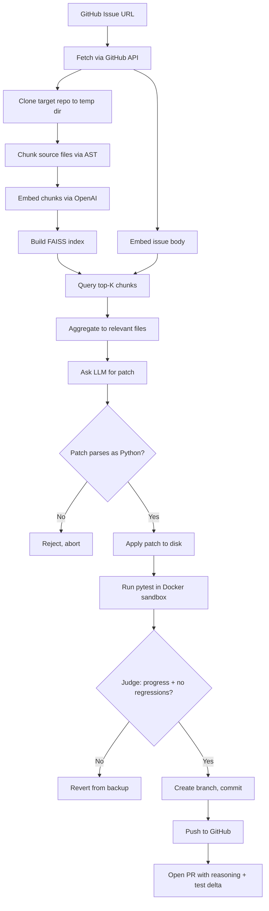

# Bug Fixer

[](https://github.com/timuryesm/bug-fixer/actions/workflows/ci.yml)

> An LLM-driven tool that reads GitHub issues, proposes patches, validates them against the test suite, and opens pull requests — autonomously. Tests run in a Docker sandbox; relevant source files are selected via FAISS retrieval.

## What it does

You point it at a GitHub issue describing a bug in a Python project. It fetches the issue, clones the repo, embeds the source code into a FAISS index to find the most relevant files, asks an LLM for a patch, validates the patch parses as Python before touching disk, runs the test suite inside a Docker container to confirm the fix is regression-free, and decides whether to keep the patch using a regression-aware comparison of pre/post test results. If the fix is good, it pushes a new branch and opens a pull request whose description includes the LLM's reasoning and the before/after test counts.

## Demo

Pull requests autonomously generated by this tool:

- [PR #2 on `timuryesm/buggy-calc`](https://github.com/timuryesm/buggy-calc/pull/2) — one-line fix to `is_prime`.
- [PR #4 on `timuryesm/buggy-calc`](https://github.com/timuryesm/buggy-calc/pull/4) — off-by-one fix to `fibonacci`.
- [PR #6 on `timuryesm/buggy-calc`](https://github.com/timuryesm/buggy-calc/pull/6) — case-insensitivity fix in `is_palindrome`. Demonstrates FAISS retrieval narrowing the LLM's view to the relevant file in a multi-file repo.
- [PR #2 on `timuryesm/schedule`](https://github.com/timuryesm/schedule/pull/2) — one-character fix to `Job.__lt__` in a 945-line single-file Python package. The bug was located by the model from a symptom-level issue description with no hint about which method to look at.

Each was opened by a single command:

```bash
python -m bug_fixer.fix --issue <github-issue-url> --open-pr
```

## How it works

The pipeline is nine stages:

1. **Fetch issue** — GitHub REST API call, parsed into a typed `Issue` record.
2. **Clone target** — shallow `git clone` over HTTPS into a temp directory.
3. **Chunk + embed source** — split each Python file into AST-level chunks (functions, methods, classes, module-level), embed each chunk via `text-embedding-3-small`, build a FAISS inner-product index.
4. **Retrieve relevant files** — embed the issue body, query FAISS for top-K most similar chunks, send only the files those chunks belong to.
5. **Baseline tests** — run `pytest -v` inside a Docker container with the cloned repo bind-mounted to `/work`. Parse output into passing/failing sets of test IDs.
6. **Ask LLM** — single OpenAI call (`gpt-4o-mini`, `temperature=0`) with the issue body and retrieved file contents.
7. **Pre-flight validate** — parse the proposed patch with `ast.parse()` before any disk write. Reject syntactically invalid code without touching the file.
8. **Apply + retest** — back up the original, write the patch, re-run `pytest` in the sandbox.
9. **Judge** — compare pre/post test sets. Four outcomes distinguished: *catastrophic* (tests didn't run after patch), *regression* (previously-passing test now fails), *no-op* (no failing test newly passes), or *progress* (regression-free and at least one newly-passing test). Only *progress* keeps the patch.

On *progress*, the tool creates a new branch, commits under a dedicated `bug-fixer` author identity, pushes via the GitHub token, and opens a PR linked back to the issue with `Fixes #N`.

### Architecture



## Engineering decisions worth noting

**LLM output transport.** I initially used JSON mode with the patched file as a JSON string field. This broke on files with triple-quoted docstrings: the model lost track of escape sequences in long string outputs and dropped quote characters, producing files that wouldn't parse. Switched to a plain-text format with a markdown code fence for the file body. The escape-sequence problem disappeared because the model writes raw Python inside the fence.

**Delta-aware test judging.** The naive criterion "all tests pass after patch" rejects good fixes in any codebase with multiple bugs. The opposite criterion "fewer failures than before" silently accepts catastrophic patches that cause pytest to error out during test collection. The implementation distinguishes both cases by comparing the *sets of test IDs* that ran before and after, not just the counts.

**AST pre-flight check.** Validating that the patch parses as Python before applying it eliminates an entire class of "broken patch overwrites real file" failures.

**Docker sandboxing.** Test execution from arbitrary repos happens inside a Docker container with the repo bind-mounted to `/work`. The container can't see the host's filesystem, environment variables, or installed packages. Without this, a malicious target repo could execute arbitrary code via `conftest.py`, `setup.py`, or installer hooks during `pytest` collection — a real risk for any tool that runs tests on code it didn't write.

**FAISS-based file retrieval.** For multi-file repos, sending the entire source directory to the LLM doesn't scale and dilutes the signal. Source files are split into AST chunks (function / class / method / module-level), each chunk is embedded with `text-embedding-3-small`, and a FAISS inner-product index is queried with the issue body to pick the most relevant chunks. The files those chunks belong to are what gets sent to the LLM.

**Author identity via env vars, not git config.** The bot's commit author identity is set per-commit through `GIT_AUTHOR_NAME` / `GIT_AUTHOR_EMAIL` rather than `git config user.name`. The cloned repo's config is never modified, so the tool can't accidentally leak its identity into commits made by humans working in the same directory.

**Token isolation.** GitHub tokens are scoped to specific repositories with the minimum required permissions, never written into the cloned repo's git config, and scrubbed from any error output before being logged.

## What this project taught me

Generating an AI patch is the easy part. The hard parts are validating the patch, deciding when to trust it, and surviving the systematic ways the model fails.

Every layer of the pipeline above the LLM call was driven by a real failure I watched happen during development: a docstring serialization error, a JSON escape bug, a "successful" patch that actually broke the test runner, a "successful" patch on an already-fixed bug. The validation layer is where the engineering lives.

Testing against a real Python package (`schedule`, a job scheduler with thousands of GitHub stars) surfaced two assumptions baked into the initial design that didn't survive contact with real code: the hardcoded `src/` layout and the heuristic that `__init__.py` files don't contain real code. Both were small fixes once observed, but neither was findable by introspection — they only appeared once V1 hit a repo it wasn't designed for.

Adding Docker sandboxing forced thinking carefully about what "trust" means in an AI tooling context. The LLM is a known-unreliable component. The target repo is a known-unreliable component. The host filesystem and credentials are trusted assets. Separating these properly with container boundaries is a real engineering responsibility, not a nice-to-have.

Adding FAISS retrieval surfaced a real limitation of embedding models: they're sensitive to lexical similarity (function names that *look* alike across files), not just semantic similarity. Retrieval over-recalls when symbol naming conventions overlap — `is_prime` and `is_palindrome` rank close together — which is exactly the kind of failure mode that doesn't appear in toy demos but matters on real codebases.

## Limitations / V3 roadmap

V2 addresses the core safety and scale concerns from V1. Remaining limitations:

- **Auto-detected pre-test setup** — repos that need `pip install -e .` or similar before pytest can run are supported via `--setup-cmd`, but it must be passed manually. Auto-detection would be a useful V3 addition.
- **Embedding cache** — chunks are re-embedded on every run. For larger repos, caching embeddings by content hash would save time and OpenAI credits.
- **Multi-file patches** — V2 still patches one file at a time. Bugs that span multiple files would require redesigning the prompt and apply steps.
- **Retry on transient failures** — if the LLM produces malformed output, the current behavior is to abort. Retry-with-feedback would handle transient failures gracefully.
- **Embedding model trade-offs** — `text-embedding-3-small` is fast and cheap but over-recalls on lexically similar symbols. `text-embedding-3-large` would likely improve precision at higher cost.

## Run it yourself

Requirements: Python 3.10+, Docker Desktop (sandbox is default; `--no-sandbox` bypasses), an OpenAI API key, and a GitHub fine-grained personal access token (for `--open-pr`).

```bash
git clone https://github.com/timuryesm/bug-fixer
cd bug-fixer
python -m venv .venv
source .venv/bin/activate
pip install -r requirements.txt

export OPENAI_API_KEY="sk-..."
export GITHUB_TOKEN="github_pat_..."     # only needed for --open-pr

# Fix a bug from a GitHub issue, open a PR with the result:
python -m bug_fixer.fix --issue <issue_url> --open-pr

# Or run locally without GitHub:
python -m bug_fixer.fix --repo path/to/repo --bug "natural language bug description"
```

Useful flags:

- `--source-dir <name>` — directory under the repo containing source files (default: `src`).
- `--top-k <N>` — number of top-ranked chunks to retrieve (default: 5).
- `--no-retrieval` — disable FAISS retrieval, send full source dir to LLM.
- `--no-sandbox` — run tests on host instead of in Docker. Unsafe for untrusted repos.
- `--setup-cmd "<cmd>"` — shell command to run inside the sandbox before pytest (e.g. `"pip install -e ."`).

Full flag list: `python -m bug_fixer.fix --help`

## Stack

Python 3.10+, OpenAI API (`gpt-4o-mini`, `text-embedding-3-small`), GitHub REST API, FAISS (CPU build), Docker, `pytest`, `requests`, `numpy`, `ast`.